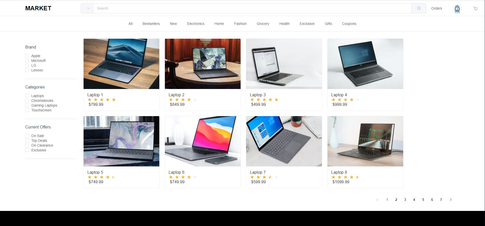

# E-Commerce Prototype Page
Interview Submission for Darwynn Ltd. - created using Vue 3, HTML, CSS, and Element Plus.
Follow the steps below to run the program. 



## Project setup
```
npm install
```

### Compiles and hot-reloads for development
```
npm run serve
```

### Compiles and minifies for production
```
npm run build
```

### Lints and fixes files
```
npm run lint
```

### Customize configuration
See [Configuration Reference](https://cli.vuejs.org/config/).
